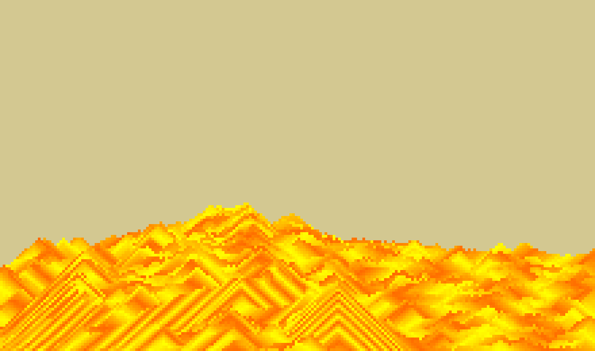

# Intro
hello wellcome to my **repo** this game is a simulation of falling sands
and it's very simple to read I write comments **everywhere**.
project is completely build with **TypeScript** and easy to understand

## Run
```bash
npm run dev
```
for start development and typescript watching your files for change

**or**
```bash
npm run build
```
for a quick build in **dist** folder

### then start a development server like liveserver vsocde extention or (xampp | wamp)

**old version: just work**


**new version:** color added

